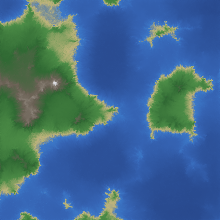
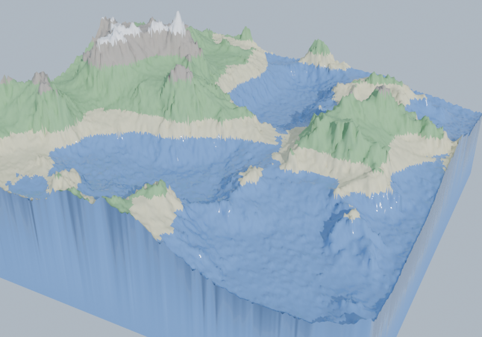

# Procedural Terrain

Generate 3D landscapes the way games do: **fractal noise** for the raw elevation, **droplet-based hydraulic erosion** to carve valleys and lay down sediment, then a **watertight mesh** and a cartographic **2D map**. Built from scratch in NumPy — the value noise and fractal Brownian motion, the erosion simulation, the hillshaded colour map, a hand-rolled PNG writer, and the terrain-to-solid mesher. Blender renders the result in 3D; it is optional.

## The headline: erosion that conserves mass

Fractal noise alone gives plausible hills but no *history* — no valleys cut by water, no fans of sediment where flow slows. Hydraulic erosion adds that by simulating tens of thousands of rain droplets, each following the downhill gradient, lifting soil where the flow is fast and steep and dropping it where the flow pools. What makes it a **simulation** rather than a filter is a hard invariant: a droplet never creates or destroys soil, it only moves it. Everything eroded is carried and eventually deposited — including before a droplet runs off the edge of the map. So the total elevation summed over the grid is **unchanged**, to floating-point precision:

```
$ python3 bench/showcase.py

seed  droplets  soil lifted  soil dropped  mass err  watertight  faces
----  --------  -----------  ------------  --------  ----------  -------
1     25,000    1200.64      1200.64       0.0e+00   yes         102,396
7     25,000    1378.47      1378.47       0.0e+00   yes         102,396
2026  25,000    1279.65      1279.65       0.0e+00   yes         102,396
42    25,000    1385.75      1385.75       1.8e-16   yes         102,396
```

Soil *lifted* and *dropped* are large — real geological work is happening — yet the net change in total elevation is zero. Generation is deterministic from the seed, and the terrain meshes into a **watertight solid** (Euler characteristic 2) ready to 3D-print, run physics on, or drop into an engine.

## From a heightmap to a world

The same eroded heightmap renders two ways.

A **2D hypsometric map** — the cartographer's elevation ramp (deep water → shallows → sand → grass → forest → rock → snow) lit by hillshading, so ridgelines and the drainage that erosion carved read at a glance:



A **3D terrain solid** — the heightmap lifted into a watertight slab, faces coloured by biome, lit by a low sun in Blender:



## Quick start

```bash
pip install -r requirements.txt          # numpy, pytest (PNG writing is from scratch)

python3 -m terrainkit --size 256 --seed 2026 --map terrain.png
python3 -m terrainkit --size 256 --seed 7 --droplets 60000 --map map.png --stl terrain.stl
python3 -m terrainkit --size 200 --seed 3 --render ./out        # 3D render in Blender
python3 -m terrainkit --size 200 --seed 3 --no-erode --map raw.png   # compare: no erosion

python3 examples/make_terrain.py         # a worked before/after example
python3 bench/showcase.py                # the mass-conservation table above
pytest tests/                            # 14 tests, headed by "erosion conserves mass"
```

## As a library

```python
from terrainkit import heightmap, erode, terrain_mesh

h = heightmap(size=256, seed=2026, octaves=7)
eroded, stats = erode(h, droplets=50000, seed=2026)

assert stats.mass_error < 1e-9           # soil moved, never created or destroyed
mesh = terrain_mesh(eroded, height_scale=3.2)
assert mesh.is_watertight()
mesh.save_stl("terrain.stl")
```

## Layout

| file | what it holds |
|---|---|
| `terrainkit/noise.py` | value noise and fractal Brownian motion — the raw elevation |
| `terrainkit/erosion.py` | droplet-based hydraulic erosion, with mass-conservation accounting |
| `terrainkit/mesh.py` | heightmap → watertight terrain solid; STL export |
| `terrainkit/colormap.py` | the hypsometric colour ramp + hillshading (the 2D map) |
| `terrainkit/image.py` | a from-scratch PNG writer (stdlib `zlib`, no PIL) |
| `terrainkit/blender_export.py` | render the terrain in 3D with biome materials, headless |
| `terrainkit/cli.py` | `python3 -m terrainkit …` |
| `tests/` | 14 tests, headed by "erosion conserves mass" |
| `bench/showcase.py` | the mass-conservation table |

See [`ARCHITECTURE.md`](./ARCHITECTURE.md) for the details — how fBm layers octaves, the droplet model step by step, exactly why the simulation is mass-conserving, and how the heightmap becomes a closed solid.

## License

MIT — see [`LICENSE`](./LICENSE).
