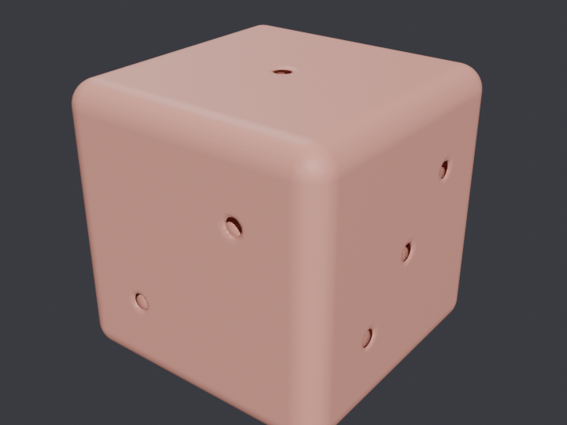

# SDF Mesher

Model 3D solids with **signed distance fields** and constructive solid geometry, then extract a **watertight, correctly-oriented triangle mesh** with **marching tetrahedra**. This is the geometry pipeline behind metaballs, voxel/destructible terrain, procedural props, and any "smooth blob" you have seen in a game or a shader — built from scratch in NumPy: the distance fields, the CSG algebra, the isosurface extractor, and the topology checks that prove the result is a real solid.

The whole appeal of SDFs is that the operations that are *hard* on meshes are *trivial* on distances. Union is a pointwise `min`, intersection a `max`, cutting B out of A is `max(A, −B)`, and a metaball melt is a smooth blend of the two. A complex model is one arithmetic expression, and the result is still a clean field you can mesh, raymarch, or query for physics.

## The headline: topology you can trust

Marching tetrahedra produces a **watertight, 2-manifold surface by construction** — no leaked holes, no doubled walls — and the mesh's **Euler characteristic then reads back the shape the booleans actually produced.** That is the real proof a CSG model joined up cleanly, and none of it is visible in a render:

```
$ python3 bench/showcase.py

model    watertight  oriented  χ   want  χ ok  genus  faces
-------  ----------  --------  --  ----  ----  -----  -------
die      yes         yes       2   2     ok    0      424,168
blob     yes         yes       2   2     ok    0      19,268
bracket  yes         yes       -6  -6    ok    4      146,344
cross    yes         yes       2   2     ok    0      98,784
ring     yes         yes       0   0     ok    1      74,480

Convergence — a unit sphere's meshed volume/area vs the analytic 4/3·π, 4·π:
   16³ grid: volume err  0.95%, area err  0.49%
   32³ grid: volume err  0.24%, area err  0.12%
   64³ grid: volume err  0.06%, area err  0.03%
```

A die is still a single ball (χ=2) after twenty-one pips are carved out of it; a four-bolt-hole bracket is *exactly* genus-4 (χ=−6); a ring is a torus (χ=0). And the meshed volume and surface area converge to the analytic values as the grid refines — the mesh is metrically right, not just topologically right.



*A six-sided die — `rounded_box − 21 pip spheres`, one SDF expression — meshed at 96³ and rendered with Cycles. Cutting 21 holes and staying a watertight solid is free with distance fields; it is a nightmare with mesh booleans.*

## Why marching *tetrahedra*

Marching cubes is more famous, but a cube has 256 corner sign patterns with genuine topological ambiguities — the saddle cases that make naïve implementations leak holes. A tetrahedron has four corners and **no ambiguity**: the surface either misses it, slices off one corner (a triangle), or separates two corners from two (a quad → two triangles). Splitting every grid cube into six tetrahedra *the same way everywhere* (the Freudenthal / Kuhn decomposition, all six sharing the cube's main diagonal) makes neighbouring cells triangulate their shared faces identically — so the surface is watertight before any cleanup, and the "which way does the saddle connect" problem never arises.

## Modelling vocabulary

**Primitives:** `Sphere`, `Box`, `Torus`, `Cylinder`.
**Operators:** `A | B` (union), `A & B` (intersection), `A - B` (difference), `A.smooth_union(B, k)` (metaball blend), `A.round(r)` (round every edge), `A.shell(t)` (hollow it out), `A.translate(v)`, `A.scale(s)`.

```python
from sdfkit import Box, Sphere, Cylinder, triangulate

# a mounting plate with a bolt hole
plate = Box((1.4, 1.0, 0.16)) - Cylinder(0.22, 1.0, center=(0.9, 0, 0))
mesh = triangulate(plate, resolution=96)

assert mesh.is_watertight() and mesh.euler_characteristic() == 0   # one through-hole → torus
mesh.save_stl("plate.stl")
```

## Blender integration

Blender is the renderer, and it is optional. `triangulate()` returns a `Mesh` verified entirely in NumPy; `blender_export` then emits a self-contained `from_pydata` build script and can run Blender headless (Cycles on CPU — no GPU, no display) to produce a `.blend` and a PNG. With no Blender installed, the mesh is already extracted and checked; you just get the STL and the script. Set `$BLENDER_BIN` or put `blender` on `PATH` to enable rendering.

## Quick start

```bash
pip install -r requirements.txt          # numpy, pytest

python3 -m sdfkit list                    # the built-in scenes
python3 -m sdfkit die --verify --stl die.stl
python3 -m sdfkit bracket --resolution 96 --verify
python3 -m sdfkit blob --render ./out     # mesh + Blender render

python3 examples/model_a_die.py           # a worked end-to-end example
python3 bench/showcase.py                  # the verification table above
pytest tests/                              # 17 tests, all measured assertions
```

## Layout

| file | what it holds |
|---|---|
| `sdfkit/sdf.py` | signed distance primitives and the CSG algebra (union/intersect/difference/blend/round/shell) |
| `sdfkit/marching.py` | marching tetrahedra: the Freudenthal decomposition and vectorised isosurface extraction |
| `sdfkit/mesh.py` | the `Mesh` type, welding soup into a manifold, topological orientation, topology/volume checks, STL/OBJ |
| `sdfkit/scenes.py` | the built-in models (die, blob, bracket, cross, ring) |
| `sdfkit/blender_export.py` | emit a `from_pydata` build script; drive Blender headless to render |
| `sdfkit/cli.py` | `python3 -m sdfkit …` |
| `tests/` | 17 tests, each a measured assertion |
| `bench/showcase.py` | the verification table |

See [`ARCHITECTURE.md`](./ARCHITECTURE.md) for the geometry — the Freudenthal decomposition, why the 1|3 and 2|2 tetrahedron cases are the whole algorithm, how triangle soup is welded and oriented (including internal cavities), and why the Euler characteristic is the right thing to check.

## License

MIT — see [`LICENSE`](./LICENSE).
