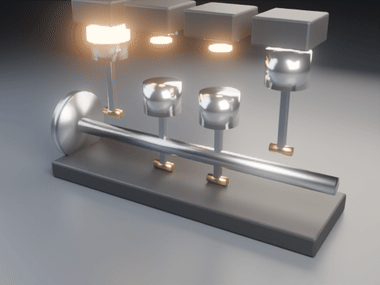

# Mechanical Engine

> Part of [Graphics & CAD](../../README.md). Runs standalone from this folder;
> the mesh type and the Blender path come from `geokit`.

A **working four-stroke engine**, animated in Blender — and every piston, connecting rod, crank pin and valve is placed by the **exact slider-crank kinematics**, frame by frame, not by hand-keyframing. The animation is a *visualisation of the equations*: if the maths were wrong, the pistons would visibly miss the rods. They don't.



## The headline: the timing is provably right

An engine only runs if the crank throws, the firing order, and the piston geometry all agree — each cylinder must reach **top dead centre exactly when the firing order says it fires**, and the power strokes must be spaced evenly around the cycle. That is checked as a number, for every preset:

```
$ python3 bench/showcase.py

slider-crank vs rod-length geometry: max deviation 4.4e-16

engine   cyl  firing order       interval  TDC err @fire  even
-------  ---  -----------------  --------  -------------  ----
inline4  4    [1, 3, 4, 2]       180°      0.0e+00        yes
inline6  6    [1, 5, 3, 6, 2, 4] 120°      0.0e+00        yes
v8       8    [1, 8, 4, 3, 6, 5, 7, 2]  90°   0.0e+00     yes
```

The crank throws aren't hand-entered — they are **derived** from the firing order (a cylinder must be at TDC when it fires, so its throw is the negative of its firing angle), which reproduces the textbook cranks exactly: an inline-four comes out `0-180-180-0`, the V8 comes out cross-plane (`0/90/180/270`). The slider-crank position matches the rod-length geometry to machine precision.

## The kinematics

A crank of radius `r` turning through angle θ, joined by a rod of length `l` to a piston on the bore axis, puts the piston at

```
x(θ) = r·cos θ + √(l² − r²·sin²θ)
```

— top dead centre (`r + l`) at θ = 0, bottom dead centre (`l − r`) at θ = π, so the stroke is exactly `2r`. The connecting rod swings by `asin(r·sinθ / l)`, and the crank pin sits exactly one rod-length from the piston pin at every angle (the invariant the animation rig relies on, checked in the tests). Each cylinder is the same mechanism with its crank throw offset around the shaft; the four-stroke cam opens the intake and exhaust valves on the correct strokes.

## Quick start

```bash
pip install -r requirements.txt          # numpy, pytest (ffmpeg used for video if present)

python3 -m enginekit timing --engine inline4     # print firing order + TDC check
python3 -m enginekit animate --engine inline4 --frames 96 --out ./out
python3 -m enginekit animate --engine v8 --frames 120 --out ./out

python3 examples/animate_inline4.py      # timing + a rendered animation
python3 bench/showcase.py                # the timing table above
pytest tests/                            # 19 tests, headed by "fires at TDC"
```

Rendering uses Blender with **Cycles** (path-traced): real metal materials — a cast-iron block, a steel crankshaft, alloy pistons, brass crank pins — bevelled edges, soft area lighting, and a **glowing combustion flash** (emissive, with a bloom pass) on whichever cylinder is firing. `ffmpeg` assembles the frames into an MP4 and a GIF. Without Blender the kinematics are still fully computed and tested; you get the emitted build script.

## As a library

```python
from enginekit import Engine

e = Engine.inline4()
print(e.firing_order)                 # [1, 3, 4, 2]
print(e.piston_displacements(90))     # each piston's distance below TDC at 90° crank
print(e.firing_angles())              # {1: 0, 3: 180, 4: 360, 2: 540}
```

## Layout

| file | what it holds |
|---|---|
| `enginekit/slider_crank.py` | the exact slider-crank position, velocity, rod angle, and crank-pin geometry |
| `enginekit/engine.py` | a multi-cylinder four-stroke: firing order, derived crank throws, valve cam timing |
| `enginekit/animate.py` | sample the kinematics per frame and drive a Blender/Workbench animation |
| `enginekit/cli.py` | `python3 -m enginekit …` |
| `tests/` | 19 tests, headed by "every cylinder fires at top dead centre" |
| `bench/showcase.py` | the timing table |

See [`ARCHITECTURE.md`](./ARCHITECTURE.md) for the derivations — the slider-crank equation, why the throws follow from the firing order, the cam model, and how the per-frame numbers become Blender keyframes.

## License

MIT — see [`LICENSE`](./LICENSE).
