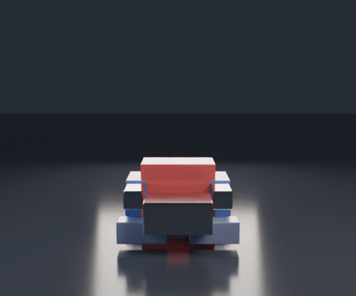

# Transformer Rig

> Part of [Graphics & CAD](../../README.md). Runs standalone from this folder;
> the mesh type and the Blender path come from `geokit`.

A **vehicle ↔ robot transformation**, animated in Blender — an original, stylised homage to the transforming-robot idea (red/blue/silver boxes, not a screen-accurate model). The engineering point is underneath the animation: the whole thing is a **rigid-body system**. Each part rotates and translates from a vehicle pose to a robot pose, but never stretches, shears, or scales — the algebraic guarantee that a good transformation rig needs and a naive vertex-blend can't give.



## The headline: it's provably rigid

Orientations are stored as **unit quaternions** and blended with **SLERP** (spherical linear interpolation). A SLERP of two unit quaternions is again a unit quaternion, so the rotation it produces is always a *proper* rotation — and that makes every part perfectly rigid, which is checked as a number across the entire morph:

```
$ python3 bench/showcase.py

Transformation rig — a rigid-body morph from vehicle to robot

  parts:                 11
  max |RᵀR − I|:         4.44e-16   (orientation stays orthonormal)
  max |det R − 1|:       4.44e-16   (proper rotation, never a reflection)
  max corner-dist error: 8.88e-16   (rigid: no stretch / shear / scale)
  keypose error @t=0/1:  0.0e+00 / 0.0e+00   (hits vehicle & robot exactly)
```

The `corner-dist error` is the one that matters: as the truck unfolds into the robot, the distance between any two corners of any part is invariant to machine precision. Nothing deforms. The parts move on **staggered timelines** — legs deploy first, arms unfold, the head rises last — which is what makes it read as *transforming* rather than *inflating*.

## How a part transforms

Each part is a box with a fixed size and two keyposes — a `(position, orientation)` for the vehicle and one for the robot. At morph time `t ∈ [0, 1]` its pose is

```
position(t) = lerp(vehicle.pos, robot.pos, s)
orientation(t) = slerp(vehicle.quat, robot.quat, s)      s = smoothstep((t − t_start)/(t_end − t_start))
```

where `[t_start, t_end]` is that part's own window in the timeline. Orientations are handed to Blender as quaternions directly, so there is no Euler-order mismatch between the maths and the render.

## Quick start

```bash
pip install -r requirements.txt          # numpy, pytest (ffmpeg used for video if present)

python3 -m transformkit check            # print the rigidity numbers
python3 -m transformkit animate --frames 96 --out ./out

python3 examples/transform.py            # rigidity check + a rendered animation
python3 bench/showcase.py                # the table above
pytest tests/                            # 12 tests, headed by "parts never stretch"
```

Rendering uses Blender with **Cycles** (path-traced): automotive-paint and chrome materials, bevelled armour panels, and a softly reflective floor the robot mirrors in, lit three-point. `ffmpeg` assembles the MP4/GIF. Without Blender the motion is still fully defined and tested.

## As a library

```python
from transformkit import optimus, quat

rig = optimus()
pose = rig.parts[1].pose_at(0.5)          # the torso, half-transformed
R = quat.to_matrix(pose.orientation)
assert abs(1 - abs(R.dot(R.T).trace()/3)) < 1  # a genuine rotation
```

## Layout

| file | what it holds |
|---|---|
| `transformkit/quat.py` | quaternion algebra and SLERP, from scratch |
| `transformkit/rig.py` | `Part`/`Pose`/`Rig` — rigid parts with two keyposes and a staggered timeline |
| `transformkit/character.py` | the truck↔robot rig (11 parts, vehicle and robot poses) |
| `transformkit/animate.py` | sample the rig per frame and drive a Blender/Workbench animation |
| `transformkit/cli.py` | `python3 -m transformkit …` |
| `tests/` | 12 tests, headed by "every part is a proper rotation throughout" |
| `bench/showcase.py` | the rigidity table |

See [`ARCHITECTURE.md`](./ARCHITECTURE.md) for the details — why SLERP keeps parts rigid, how the staggered timeline is built, and how quaternion poses become Blender keyframes.

## License

MIT — see [`LICENSE`](./LICENSE).
